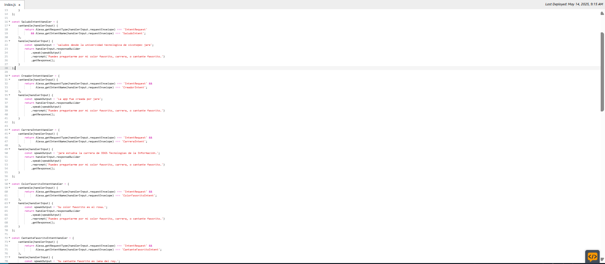
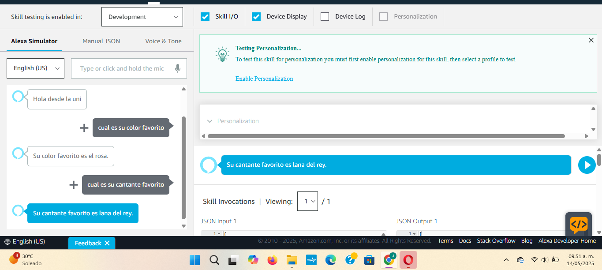

# practica03_220418

    
    

      

UNIVERSIDAD TECNOLÓGICA DE XICOTEPEC DE JUÁREZ

Materia: Extraccion de conocimientos de bases de datos   
Docente: Marco Antonio Ramírez Hernandez   
Alumno: Jareni Gomez Juan   
Matrícula: 220418   

Práctica 03: Esta skill responde a 4 comandos especificos  usando el modelo de interacción de Alexa:

- cual es su color favorito
- cual es su cantante favorito
- que carrera estudia
- quien creo la aplicacion
 

Fecha entrega: 14 de mayo del 2025

 

### Imágenes de la APP
#### codigo

    

#### Testing

    

